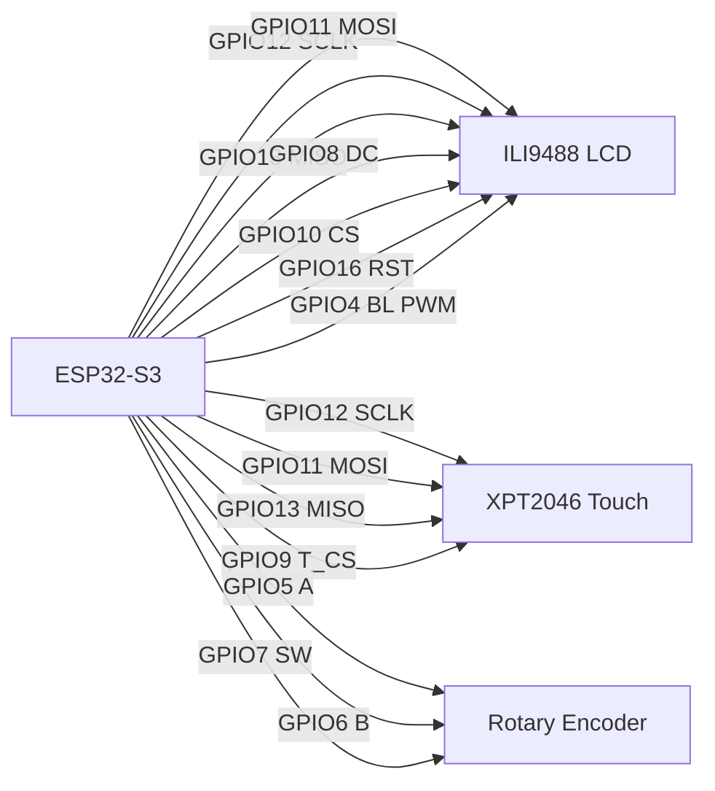

# ESP32-S3 DCC Controller

Touchscreen DCC-EX WiThrottle controller running on ESP32-S3 with LVGL UI.

## Where Connections And Devices Are In Source

Use this map to find where network connections, discovered devices, and hardware devices are implemented.

### Entry Point

- `main/main.cpp`
	- App startup (`app_main`), NVS init, LVGL init, touch input callback, display sleep/wake logic.
	- Starts Wi-Fi init task and shows initial screens.

### Wi-Fi Connection And mDNS Device Discovery

- `main/utilities/WifiHandler.h`
	- Defines `WithrottleDevice` and Wi-Fi manager APIs.
- `main/utilities/WifiHandler.cpp`
	- Connects to saved/manual SSID.
	- Handles Wi-Fi events (`WIFI_EVENT`, `IP_EVENT`).
	- mDNS search loop for `_withrottle._tcp` devices.
	- Stores discovered devices in `withrottle_devices`.

### DCC Server TCP Connection And Protocol

- `main/connection/wifi_control.h`
	- `WifiControl` singleton that owns DCC TCP connection state.
- `main/connection/wifi_control.cpp`
	- Creates lwIP TCP connection to DCC server.
	- Owns `DCCEXProtocol` lifecycle and polling loop task.
	- Handles disconnect/failure and publishes LVGL messages.
- `main/connection/wifi_connection.h`
	- `TCPSocketStream` implementation over lwIP TCP.
	- Heartbeat timeout checks and error callback handling.
- `main/connection/dcc_delegate.h`
	- Delegate callbacks for roster, turnout, route, turntable, power, and loco updates.
- `main/connection/dcc_delegate.cpp`
	- Converts incoming DCC-EX protocol events into app/UI updates.

### UI Screens For Wi-Fi And DCC Devices

- `main/display/WifiConnectScreen.*`
	- Manual Wi-Fi connect UI.
- `main/display/WifiListScreen.*`
	- Shows discovered Wi-Fi / mDNS DCC devices.
- `main/display/ConnectDCC.*`
	- DCC connection screen and flow.
- `main/display/RosterList.*`
	- Locomotive roster list UI.
- `main/display/TurnoutList.*`
	- Turnout list and state changes.
- `main/display/RouteList.*`
	- Route controls.
- `main/display/TurntableList.*`
	- Turntable controls.

### Shared Messages And Storage Keys

- `main/definitions.h`
	- LVGL message IDs (`MSG_WIFI_*`, `MSG_DCC_*`).
	- NVS namespaces/keys for calibration, Wi-Fi credentials, and saved DCC host/port.

## Hardware Connections (Current Project Defaults)

Display and touch pins are defined in `main/LGFX_ILI9488_S3.hpp`:

| Device | Signal | ESP32-S3 GPIO |
|---|---|---|
| ILI9488 LCD | SCLK | 12 |
| ILI9488 LCD | MOSI | 11 |
| ILI9488 LCD / XPT2046 touch | MISO | 13 |
| ILI9488 LCD | DC | 8 |
| ILI9488 LCD | CS | 10 |
| ILI9488 LCD | RST | 16 |
| LCD backlight (PWM) | BL | 4 |
| XPT2046 touch | CS | 9 |

Rotary encoder is enabled in this project `sdkconfig` and currently set to:

- A: GPIO 5
- B: GPIO 6
- SW: GPIO 7

Rotary defaults/options are configured via `main/Kconfig.projbuild` and `idf.py menuconfig`.

## Wiring Diagram



Pin source files:

- `main/LGFX_ILI9488_S3.hpp` (LCD + touch)
- `sdkconfig` (current rotary encoder GPIO values)

## How To Program (Flash) The ESP32-S3

This project uses ESP-IDF and targets `esp32s3`.

### Prerequisites

- ESP-IDF v5.5.1 installed.
- USB connected ESP32-S3 board.
- Serial permissions (Linux user in `dialout` group, if required).

### CLI Method (idf.py)

From project root:

```bash
cd /home/mathew/src/esp32-dcc-controller
source /home/mathew/.esp/v5.5.1/esp-idf/export.sh
idf.py set-target esp32s3
idf.py build
idf.py -p /dev/ttyUSB0 flash monitor
```

Notes:

- Replace `/dev/ttyUSB0` with your board port (for example `/dev/ttyACM0`).
- Exit monitor with `Ctrl+]`.

### VS Code ESP-IDF Extension Method

1. Open this folder in VS Code.
2. Select the ESP-IDF target: `esp32s3`.
3. Run `ESP-IDF: Build your project`.
4. Run `ESP-IDF: Flash your project`.
5. Run `ESP-IDF: Monitor your device`.

## Useful Files

- `sdkconfig` - active build configuration.
- `partitions.csv` - partition layout.
- `main/idf_component.yml` - external dependencies (LVGL, LovyanGFX, DCCEXProtocol, mdns, button).
